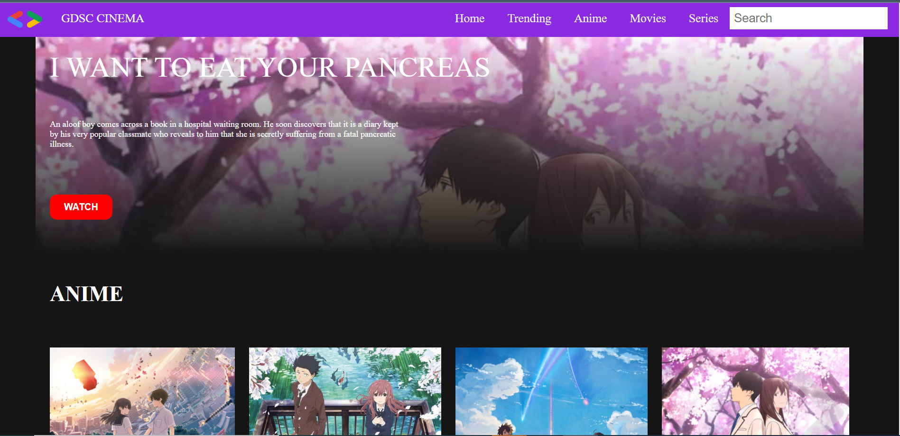

# MoviesWebsite

Pada project kali ini saya membuat sebuah Movies Website dengan memanfaatkan data movies yang saya buat dan memanfaatkannya dengan javascript untuk mengaksesnya
, dengan beberapa fitur:

    1. Menampilkan deskripsi movies tersebut, jika dipencet tombol watch
    2. Membuat filter search

NOTE = DIKARENAKAN H-1 BARU TAU DISURUH MENGAMBIL DATA FREE REST API'S ATAU MEMBUAT DATA,SEHINGGA ADA FUNGSI YANG BELUM TEREALISASI DENGAN BAIK....DISPLAY LIST OF IMAGES DENGAN AKSES DATA BLOM TEREALISASI DENGAN BAIK SEHINGGA BLOM SELESAI.
